## Development Continues...
It is not the final state.

---

# Requirements

* <b> JDK 17 </b>
* <b> Maven </b>
* <b> Rabbit MQ Server </b> : Available in docker-compose file.
* <b> Zipkin Server </b>    : Available in docker-compose file. Just start the server to trace (Default Port: 9411)
* <b> Build Dependencies In Order Of Writing </b>  
    
    * <b> Build COC-Cloud-Main-Parent Pom Project </b> : Jar should be exist in .m2 local folder. (mvn clean install)
    * <b> Build COC-Cloud-Parent Pom Project </b>      : Jar should be exist in .m2 local folder. (mvn clean install)
    * <b> Build COC-Core-Ms-App Project </b>           : Jar should be exist in .m2 local folder. (mvn clean install)
    * <b> Build COC-Core Project </b>                  : Jar should be exist in .m2 local folder. (mvn clean install) (https://github.com/erensayar/BE-Core.git)

---

# Architecture

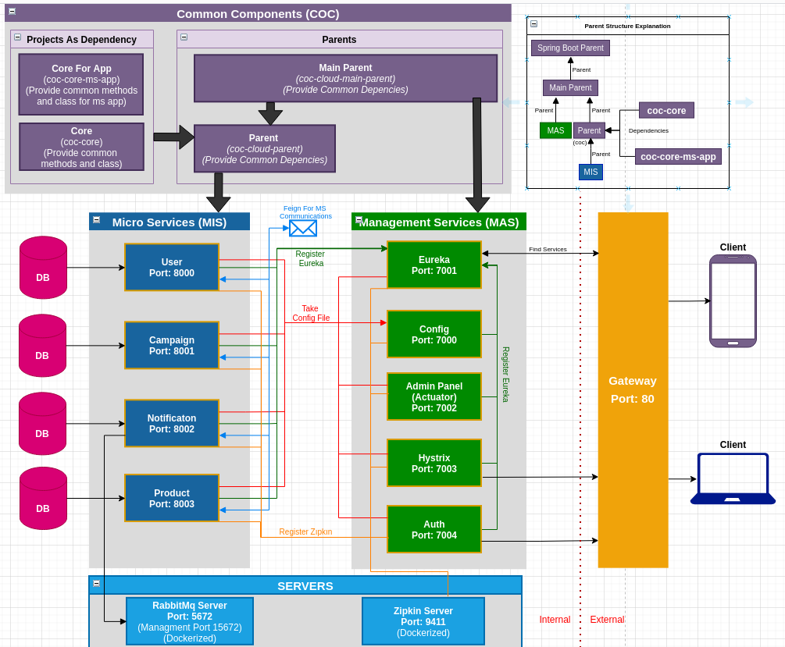

# Working Principle
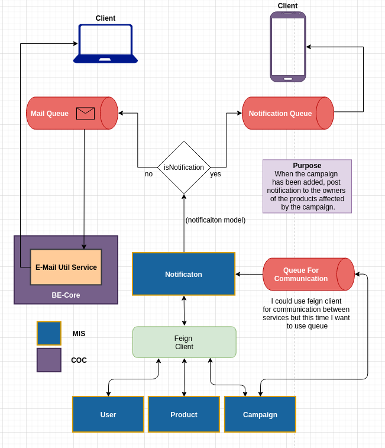

# Logic
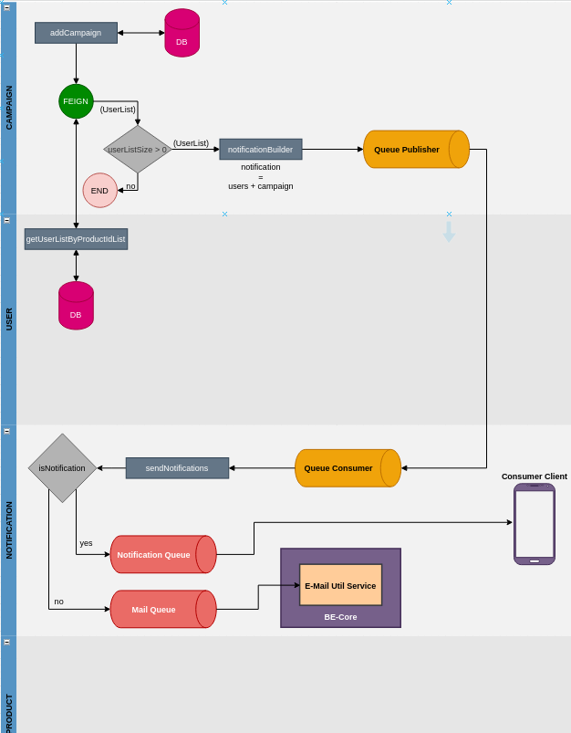

# Entities Look Like These
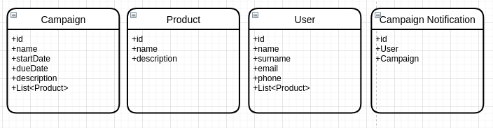

---

# Microservice Utility Modules SS

<b>Eureka</b>

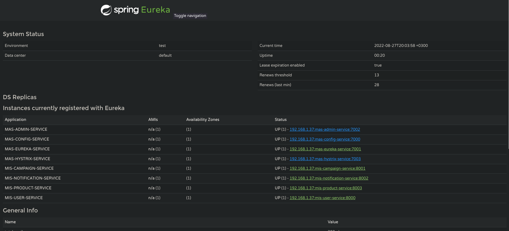

<b>Admin Server</b>

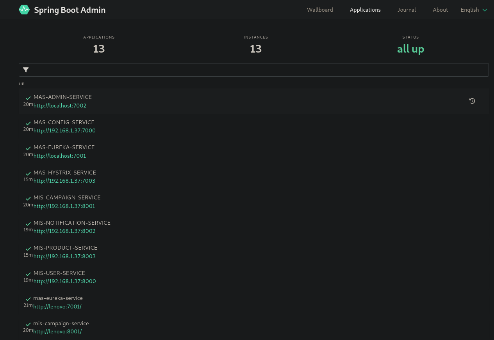
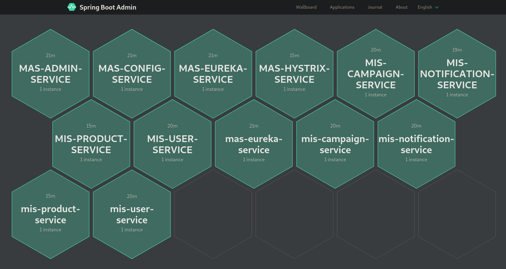
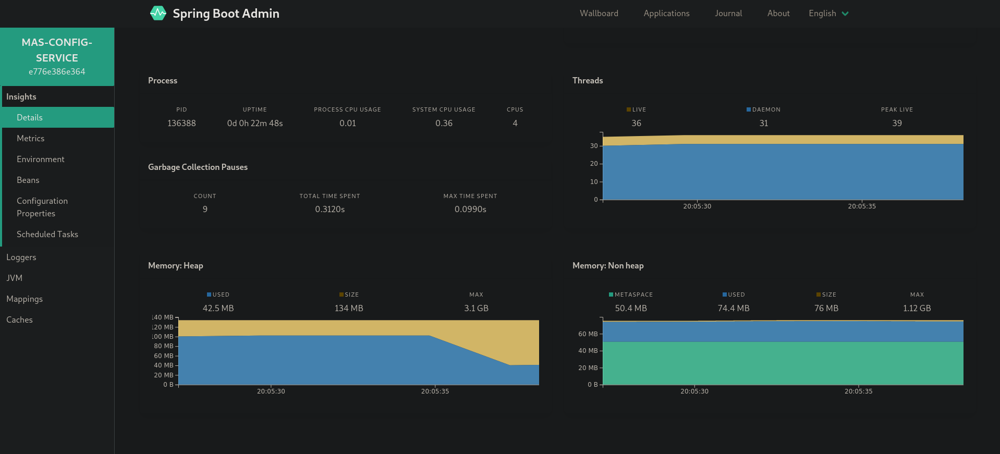

<b>Zipkin</b>

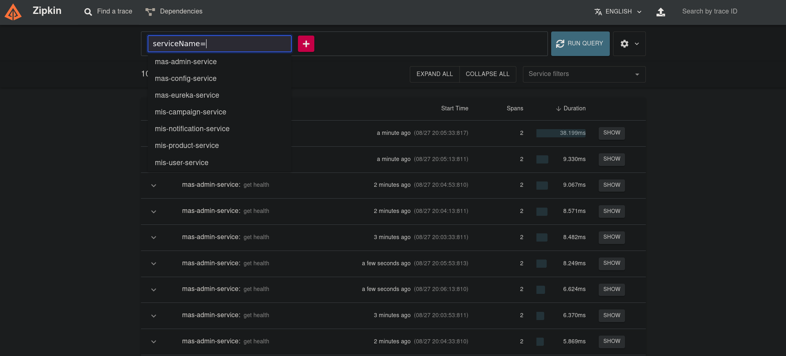
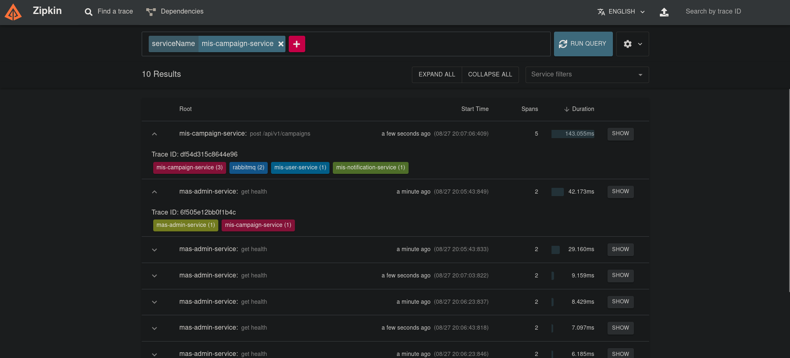
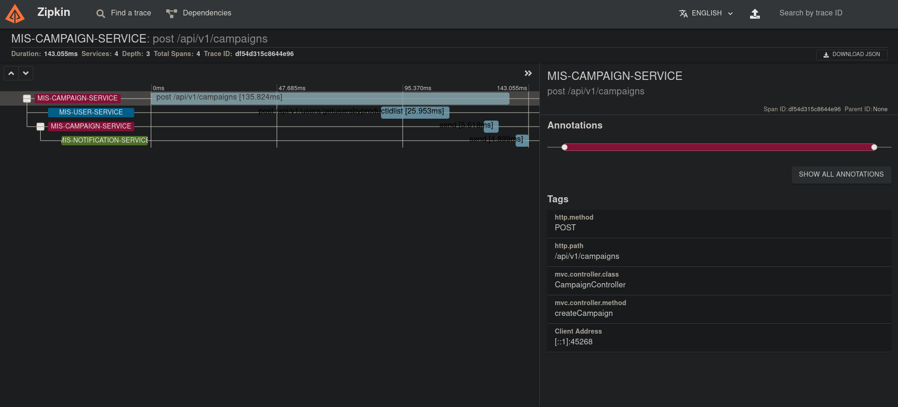

<b>RabbitMqManager</b>

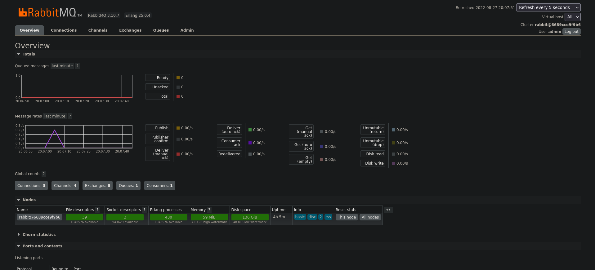

# Done

* MS Structure (MAS)
* Load Balancing
* Feign Communication
* Query Communication
* Business (MIS) for test

# TO-DO

* Gateway implementation
* Dockerized Modules
* Config server encryption-decryption
* Hot config update (refreshcope etc..)
* Load Balancing (improvement)
* Duplicated usage fix for query
* Admin server duplicate instance?
* Mail notification structure implementation
* Phone notification implementation
* Phone notification simulation
* Auth server

# DB URL

* User : jdbc:h2:mem:user-db
* Product : jdbc:h2:mem:product-db
* Notification : jdbc:h2:mem:notification-db
* Campaign : jdbc:h2:mem:campaign-db

# Test Data

(These are not necessary for now)

<b>USER</b>

| ID  |  EMAIL         | NAME          | PHONE           | SURNAME          |
|-----|----------------|---------------|-----------------|------------------|
| 1   | user1@mail.com | user-1-name   | +905552223344   | user-1-surname   |
| 2   | user2@mail.com | user-2-name   | +905552223344   | user-2-surname   |
| 3   | user4@mail.com | user-3-name   | +905552223344   | user-3-surname   |
| 4   | user4@mail.com | user-4-name   | +905552223344   | user-4-surname   |
| 5   | user5@mail.com | user-5-name   | +905552223344   | user-5-surname   |

<b>Product</b>

| ID  | DESCRIPTION            | NAME       |
|-----|------------------------|------------|
| 1   | Product-1-Description  | Product-1  |
| 2   | Product-2-Description  | Product-2  |
| 3   | Product-3-Description  | Product-3  |
| 4   | Product-4-Description  | Product-4  |
| 5   | Product-5-Description  | Product-5  |

			
			
			