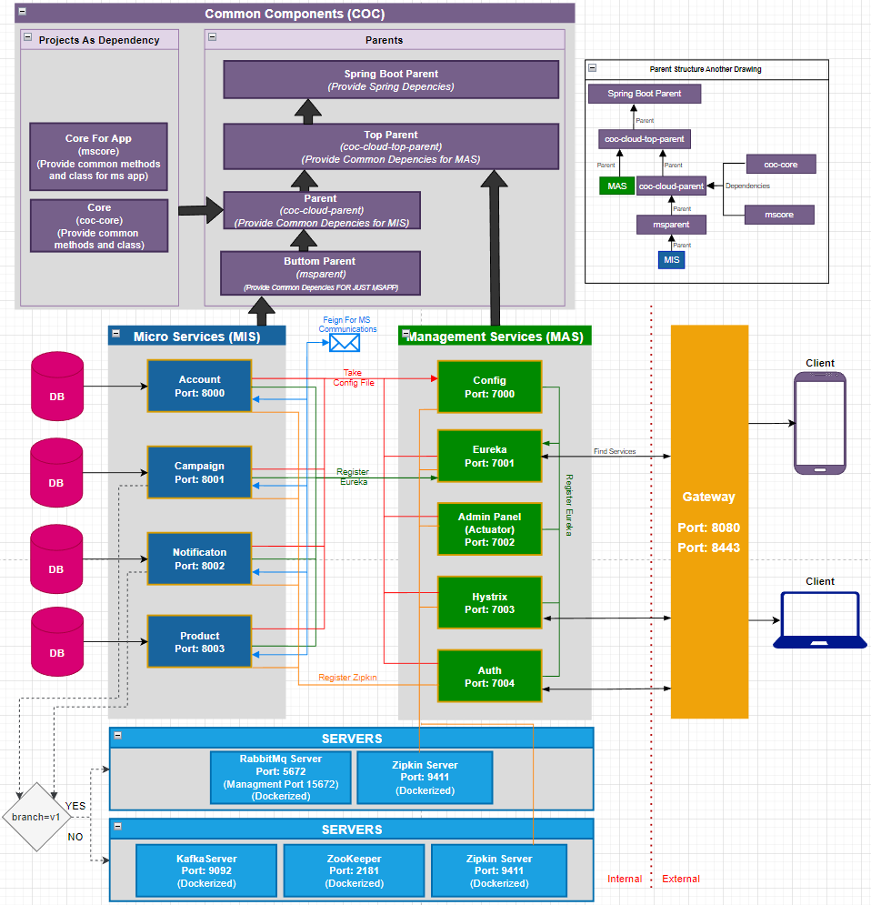

# Development Continues

* It is not the final state
* Almost done

---

## What this repository for?
This project microservice architecture implementation trying on spring cloud ecosystem.

### Used Spring Cloud Modules
* Config Server
* Eureka Server
* Spring Cloud Gateway
* Spring Cloud Load Balancer
* Hystrix
* Admin Panel
* Zipkin

---

# Requirements

* <b> JDK 17 </b>
* <b> Maven </b>
* <b> Rabbit MQ Server </b> : Available in docker-compose file.
* <b> Zipkin Server </b>    : Available in docker-compose file. Just start the server to trace (Default Port: 9411)
* <b> Build Dependencies In Order Of Writing </b>  

  | Dependency Or Parent          | Description                                                  | Repository                                                   |         
  |-------------------------------|--------------------------------------------------------------|--------------------------------------------------------------|
  | <b> coc-cloud-top-parent </b> | Pom should be exist in .m2 local folder. (mvn clean install) | https://github.com/erensayar/common-components               |
  | <b> coc-cloud-parent </b>     | Pom should be exist in .m2 local folder. (mvn clean install) | https://github.com/erensayar/common-components               |
  | <b> coc-core-ms-app </b>      | Jar should be exist in .m2 local folder. (mvn clean install) | In this Repo                                                 |
  | <b> coc-core </b>             | Jar should be exist in .m2 local folder. (mvn clean install) | https://github.com/erensayar/common-components               |

# Architecture

# Working Principle

# Logic

# Entities Look Like These

---

# Dockerizing Modules

In project root directory:

    mvn docker:build

#### When you run this command

    docker image ls

#### It should look like this

| REPOSITORY                      | TAG          | SIZE    |
|---------------------------------|--------------|---------|
| ms-app-mis-user-service         | 1.0.0        | 256MB   |
| ms-app-mis-user-service         | latest       | 256MB   |
| ms-app-mis-product-service      | 1.0.0        | 256MB   |
| ms-app-mis-product-service      | latest       | 256MB   |
| ms-app-mis-notification-service | 1.0.0        | 258MB   |
| ms-app-mis-notification-service | latest       | 258MB   |
| ms-app-mis-campaign-service     | 1.0.0        | 258MB   |
| ms-app-mis-campaign-service     | latest       | 258MB   |
| ms-app-mas-hystrix-service      | 1.0.0        | 219MB   |
| ms-app-mas-hystrix-service      | latest       | 219MB   |
| ms-app-mas-eureka-service       | 1.0.0        | 219MB   |
| ms-app-mas-eureka-service       | latest       | 219MB   |
| ms-app-mas-admin-service        | 1.0.0        | 224MB   |
| ms-app-mas-admin-service        | latest       | 224MB   |
| ms-app-mas-config-service       | 1.0.0        | 220MB   |
| ms-app-mas-config-service       | latest       | 220MB   |

---

#### Delete All Created Images

    docker rmi $(docker images | grep 'ms-app-')

---

# Done

* MS Structure (MAS)
* Feign Communication
* Query Communication
* Business (MIS)
* Dockerizing Modules

# TO-DO

* <b> Gateway improvement with spring cloud gateway </b>
* <b> Load Balance improvement with spring cloud load balancer</b>
* Config server encryption-decryption
* Hot config update (refreshcope etc..)
* Admin server duplicate instance?
* Auth server

---

* Mail notification implementation
* Phone notification implementation
* Phone notification simulation

# DB URL

* User : jdbc:h2:mem:user-db
* Product : jdbc:h2:mem:product-db
* Notification : jdbc:h2:mem:notification-db
* Campaign : jdbc:h2:mem:campaign-db

# Test Data

(These are not necessary for now)

<b>USER</b>

| ID  |  EMAIL         | NAME          | PHONE           | SURNAME          |
|-----|----------------|---------------|-----------------|------------------|
| 1   | user1@mail.com | user-1-name   | +905552223344   | user-1-surname   |
| 2   | user2@mail.com | user-2-name   | +905552223344   | user-2-surname   |
| 3   | user4@mail.com | user-3-name   | +905552223344   | user-3-surname   |
| 4   | user4@mail.com | user-4-name   | +905552223344   | user-4-surname   |
| 5   | user5@mail.com | user-5-name   | +905552223344   | user-5-surname   |

<b>Product</b>

| ID  | DESCRIPTION            | NAME       |
|-----|------------------------|------------|
| 1   | Product-1-Description  | Product-1  |
| 2   | Product-2-Description  | Product-2  |
| 3   | Product-3-Description  | Product-3  |
| 4   | Product-4-Description  | Product-4  |
| 5   | Product-5-Description  | Product-5  |

---

# Microservice Utility Modules SS

<b>Eureka</b>

<b>Admin Server</b>

<b>Zipkin</b>

images/
<b>RabbitMqManager</b>

---

### Tags
* spring cloud microservice example
* microservice example
* api gateway example
* spring cloud gateway example
* load balance example
* spring cloud load balancer example
* config server example
* eureka server example
* admin server example
* zipkin example